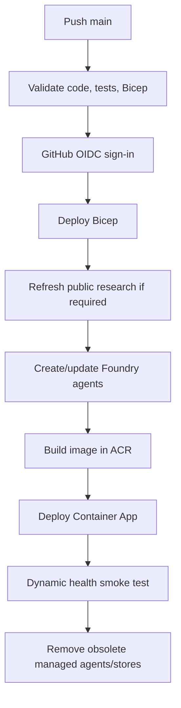
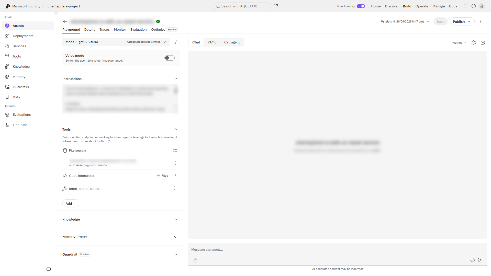

# Deployment reference

> **Documentation:** [Home](README.md) · [AI-assisted setup](AI-SETUP-PROMPT.md) · [Manual setup](SELF-HOSTING.md) · [Authentication](AUTH-SETUP.md) · [Storage](STORAGE.md)

ClientSphere uses Bicep and GitHub Actions OIDC. It does not use an Azure publish profile, service-principal client secret, Azure AI key, Speech key, or registry password.

For the complete first-time procedure, use [SELF-HOSTING.md](SELF-HOSTING.md).

## Bootstrap

From a clone of the target GitHub repository:

```powershell
az login
gh auth login
.\scripts\bootstrap-github-oidc.ps1 -SubscriptionId "<azure-subscription-id>"
```

The script discovers the repository and GitHub login, enforces GitHub's immutable repository-ID-bound OIDC subject, derives a stable unique suffix, creates the Azure deployment identity and federated credential, restricts production deployment to `main`, grants deployment roles, creates repository variables, and generates `SESSION_SECRET`.

Use `Get-Help .\scripts\bootstrap-github-oidc.ps1 -Detailed` or inspect the parameter block to override repository, tenant, admin login, suffix, or regions.

## Provisioned resources

With suffix `<suffix>`, `infra/main.bicep` creates:

| Resource | Default name |
|---|---|
| Resource group | `rg-clientsphere-<suffix>` |
| Azure AI Services / Foundry | `clientsphere-ai-<suffix>` |
| Foundry project | `clientsphere-project` |
| General/Sol model | `gpt-5.6-sol` |
| Multimodal/Luna model | `gpt-5.6-luna` |
| Reasoning/Terra model | `gpt-5.6-terra` |
| Container App | `clientsphere-<suffix>` |
| Container Apps environment | `cae-clientsphere-<suffix>` |
| Azure Container Registry | `acrclientsphere<suffix>` |
| Key Vault | `kv-clientsphere-<suffix>` |
| Application Insights | `appi-clientsphere-<suffix>` |
| Log Analytics | `log-clientsphere-<suffix>` |

The Container App uses its system-assigned managed identity for existing Foundry agents, Speech, private image pulls, and access-state persistence. The live Fabric mode separately uses a short-lived delegated Microsoft Entra user token because Fabric Data Agents do not support application-only authentication. The orchestrator calls four published Fabric Data Agent MCP endpoints directly through user-token-passthrough project connections, avoiding extra A2A and nested-toolbox latency.





## Workflow

Every push or manual dispatch of `.github/workflows/deploy.yml`:

1. validates JavaScript, tests, and Bicep;
2. signs in through OIDC;
3. creates or updates infrastructure;
4. preserves encrypted access state and previous agent metadata;
5. refreshes public research and agents when required;
6. builds in Azure Container Registry;
7. deploys to Azure Container Apps;
8. applies OAuth, optional delegated Microsoft Entra, and optional email configuration;
9. verifies dynamic customer, agent-mode, live-agent, and identity counts;
10. deletes obsolete managed agents and vector stores.

Pull requests run validation only. Deployment concurrency is serialized so two runs cannot mutate agent or access state simultaneously.

Force a refresh:

```powershell
gh workflow run deploy.yml --ref main -f refresh_customer_agents=true
```

The scheduled workflow dispatches the same production path every Monday at 05:00 UTC.

## Deployment inputs

Required repository variables:

```text
AZURE_CLIENT_ID
AZURE_CLIENT_OBJECT_ID
AZURE_TENANT_ID
AZURE_SUBSCRIPTION_ID
AZURE_RESOURCE_GROUP
AZURE_CONTAINER_APP_NAME
AZURE_LOCATION
AZURE_AI_LOCATION
CLIENTSPHERE_SUFFIX
ADMIN_LOGINS
```

Required secret:

```text
SESSION_SECRET
```

The live Fabric mode additionally requires repository variable `ENTRA_CLIENT_ID`, secret `ENTRA_CLIENT_SECRET`, `FABRIC_WORKSPACE_ID`, all four `FABRIC_*_AGENT_ID` variables, and **Foundry Agent Consumer** on the project for every delegated user or user group. Run `scripts/configure-live-fabric.ps1` after the base application and Fabric Data Agents exist; it stores the identity and item values securely and dispatches a full agent refresh.

OAuth secrets:

```text
GH_OAUTH_CLIENT_ID
GH_OAUTH_CLIENT_SECRET
```

Optional email values are documented in [EMAIL-WORKFLOW.md](EMAIL-WORKFLOW.md).

Optional custom avatar/voice repository variables are managed by `scripts/configure-custom-avatar.ps1` and applied as Container App environment values by Bicep. They remain disabled by default; see [custom-avatar/README.md](custom-avatar/README.md).

The optional live Manufacturing Fabric mode uses five repository variables: `FABRIC_WORKSPACE_ID` plus one current Data Agent ID for Factory Pulse, Reliability, Quality, and Delivery Impact. Agent provisioning creates or reconciles four `RemoteTool` MCP connections directly to those published Data Agent endpoints on every agent refresh; no manually created Microsoft Fabric connection, A2A wrapper, or nested toolbox is required.

## Foundry Web Search

Every customer general adviser is provisioned with the built-in `web_search` tool alongside its isolated file search and guarded official-source fetch. Synthetic use-case agents and shared Fabric live agents do not receive unrestricted Web Search.

No separate Bing resource or project connection is required. An Azure administrator can block the tool at subscription level through `Microsoft.CognitiveServices/OpenAI.BlockedTools.web_search`; a blocked subscription causes live search calls to fail rather than silently falling back.

Web Search is billable and sends search data to Grounding with Bing outside Azure compliance and geographic boundaries; the Microsoft Data Protection Addendum does not apply to that data path. Prompts must never send secrets, private account data, or customer-confidential content to Web Search.

## Completion criteria

A base deployment is complete when:

- the workflow conclusion is `success`;
- `/healthz` returns `status: "ok"`;
- `customers` and `agentsConfigured` match `config/customers.json`;
- `agentModesConfigured` is five times the customer count;
- GitHub OAuth returns to the deployed `/auth/callback`;
- the configured bootstrap login can open `/admin`.

For a live-Fabric deployment, `liveFabricAgentsConfigured` must also be four, `liveOrchestratorConfigured` must be true, and `fabricAuthConfigured` must be true.
