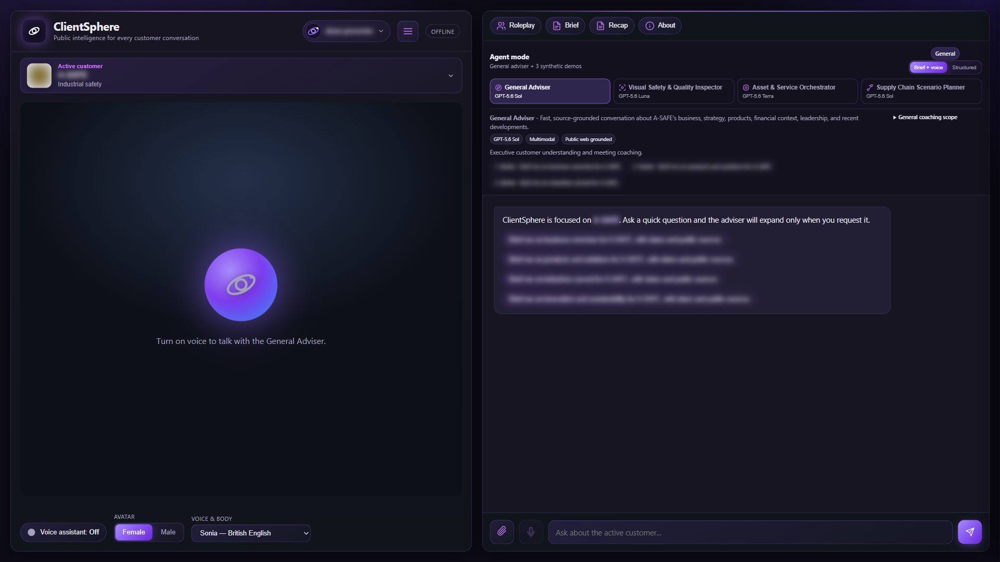
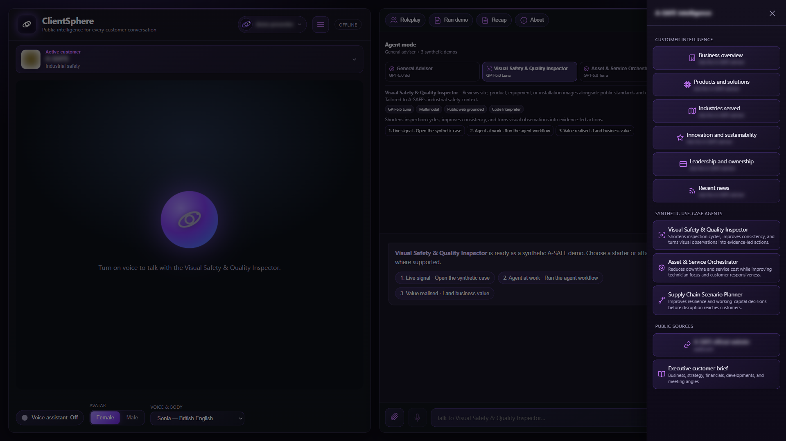
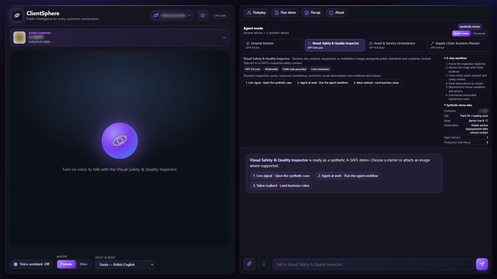
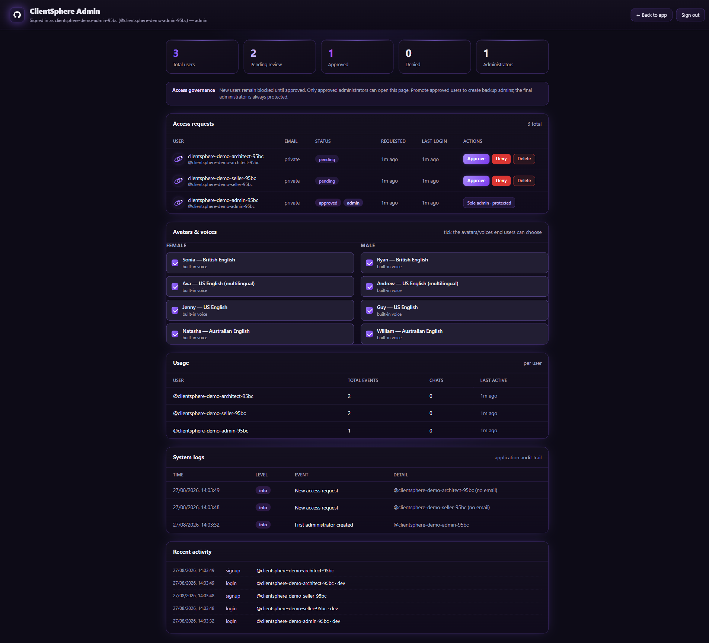
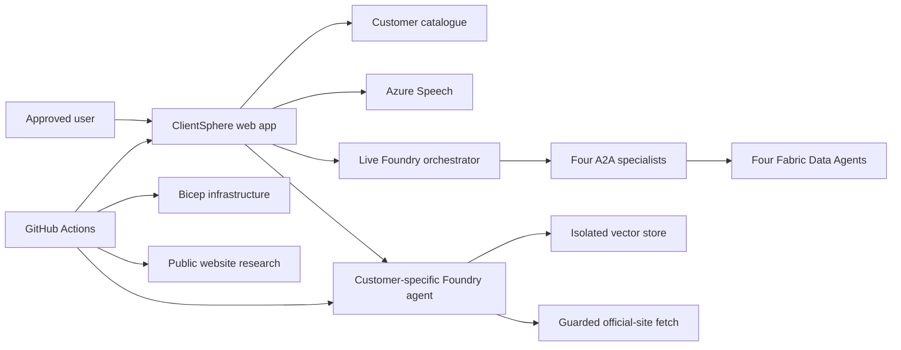

# ClientSphere

> **Start here:** [AI-assisted setup](AI-SETUP-PROMPT.md) · [Manual setup](SELF-HOSTING.md) · [Product tour](docs/SCREENSHOTS.md) · [Deployment](DEPLOYMENT.md) · [Security and storage](STORAGE.md)

ClientSphere turns a list of organisations and their official public websites into an access-controlled customer-intelligence and meeting-coaching application on Azure. Every configured customer receives an isolated knowledge store, a general adviser, three sector-tailored demonstration agents, and an optional shared live-manufacturing experience backed by Microsoft Fabric.



> All screenshots in this repository use redacted or synthetic demonstration data. Your deployment is generated from your own `config/customers.json`.

## The simplest way to repurpose it

| Route | Best for | Start |
|---|---|---|
| **AI-assisted setup (recommended)** | Microsoft Scout, GitHub Copilot coding agent, or Copilot CLI users who want the repository reconfigured and deployed for them | Copy [the complete setup prompt](AI-SETUP-PROMPT.md) into the agent while it is open in your clone |
| **Manual setup** | Users who prefer to run each command and review each Azure/GitHub step themselves | Follow [SELF-HOSTING.md](SELF-HOSTING.md) from top to bottom |

The AI-assisted prompt tells the agent to:

- replace the existing customer catalogue rather than merge with it;
- tailor sectors, scenarios, branding, owner details, and every Markdown file;
- use your Azure tenant, subscription, regions, and GitHub repository;
- bootstrap immutable repository-bound OIDC without storing an Azure client secret;
- keep OAuth and optional email secrets out of files and shell history;
- deploy, configure your administrator, run smoke tests, and return the live URL;
- stop for the few identity or consent actions that cannot safely be automated.

## What users can do

- Search and switch between configured customers.
- Ask for concise, evidence-led public intelligence with Foundry Web Search for current customer-relevant information.
- Open a structured customer brief with sources and dates.
- Run three synthetic, sector-specific agent workflows per customer.
- Query a governed live Fabric demo through one orchestrator and four domain specialists.
- Upload a bounded image to supported multimodal demonstrations.
- Rehearse customer conversations with roleplay and coaching.
- Use Azure Speech voices and real-time avatars.
- Keep customer conversations and retrieval stores isolated.

| Public intelligence | Guided agent workflow |
|---|---|
|  |  |

[View the full product screenshot tour](docs/SCREENSHOTS.md).

## What administrators can do

- Approve, deny, return to pending, or delete users.
- Promote approved users to administrator.
- Hand ownership to another administrator safely.
- Show or hide voices and avatars.
- Inspect recent usage and operational logs.
- Protect the sole administrator from accidental removal.



## How it works



| Layer | Implementation |
|---|---|
| Web application | Node.js 22, Express, static browser UI |
| AI | Azure AI Foundry project with GPT-5.6 Sol, Luna, and Terra deployments |
| Knowledge | Official-site crawler, one isolated vector store per customer, and Foundry Web Search on general advisers |
| Voice and avatar | Azure Speech with keyless token brokering |
| Identity | GitHub OAuth plus ClientSphere's approved-user/admin registry; delegated Microsoft Entra identity for live Fabric |
| Hosting | Azure Container Apps and Azure Container Registry |
| Delivery | Bicep and GitHub Actions using immutable repository-bound OIDC |
| Secrets | GitHub encrypted secrets and Container App secret references |

## Customer input

`config/customers.json` is the only required business input. **Replace the complete existing array before deploying a fork.**

```json
[
  {
    "id": "example-manufacturing",
    "name": "Example Manufacturing",
    "website": "https://www.example-manufacturing.com/",
    "sector": "Industrial manufacturing",
    "summary": "A short description based only on public information.",
    "topics": [
      "Business overview",
      "Products and services",
      "Strategy",
      "Operations",
      "Sustainability",
      "Recent news"
    ]
  }
]
```

Rules:

- `id`: stable, unique, lowercase letters/numbers/hyphens only.
- `website`: the organisation's official HTTPS website.
- `sector`: plain-language industry description used to choose scenarios.
- `summary` and `topics`: public catalogue guidance only.
- Never add private communications, account notes, credentials, opportunity data, or customer-confidential material.

Validate any catalogue with:

```powershell
npm ci
npm run customers:validate
npm run check
npm test
```

## Production setup

1. Create your own GitHub fork or repository and clone it.
2. Replace `config/customers.json`.
3. Sign in with `az login` and `gh auth login`, then set your clone's `owner/repository` as the GitHub CLI default.
4. Run:

   ```powershell
   .\scripts\bootstrap-github-oidc.ps1 -SubscriptionId "<azure-subscription-id>"
   ```

5. Commit and push to `main`; GitHub Actions provisions Azure, researches the official sites, builds the available agents, and deploys the app.
6. Create the GitHub OAuth App for the generated URL, then run:

   ```powershell
   .\scripts\configure-github-oauth.ps1
   ```

7. To enable live Fabric, publish four Fabric Data Agents, add the four named Microsoft Fabric connections, grant users **Foundry Agent Consumer**, register the delegated Entra application, then run `.\scripts\configure-live-fabric.ps1`.
8. Sign in with the GitHub login selected during bootstrap and manage users at `/admin`.

Use [SELF-HOSTING.md](SELF-HOSTING.md) for prerequisites, exact commands, regions/models, role assignments, troubleshooting, and removal.

## Secrets and generated files

| Value | Stored as | Created by |
|---|---|---|
| `SESSION_SECRET` | GitHub secret | OIDC bootstrap script |
| GitHub OAuth client ID/secret | GitHub secrets | Secure OAuth helper |
| Entra live-Fabric client ID/secret | GitHub variable/secret | Secure live-Fabric helper |
| ACS connection string | GitHub secret, optional | Secure email helper |
| Azure/GitHub resource identifiers | GitHub variables | OIDC bootstrap script |
| Optional custom avatar/voice identifiers | GitHub variables | Custom avatar helper |
| Customer research | Generated and ignored | Deployment workflow |
| Foundry agent/vector-store IDs | Generated and ignored | Deployment workflow |
| Local user and usage data | Ignored | Running application |

Do not force-add `.env`, `data/`, `knowledge/customers/`, or `customer-agents.json`.

Secure configuration helpers:

```powershell
.\scripts\configure-github-oauth.ps1
.\scripts\configure-live-fabric.ps1
.\scripts\configure-email.ps1
.\scripts\configure-custom-avatar.ps1 -Disable
```

## Documentation

| Document | Use it for |
|---|---|
| [AI-SETUP-PROMPT.md](AI-SETUP-PROMPT.md) | Complete prompt for Microsoft Scout or GitHub Copilot to repurpose and deploy the repository |
| [SELF-HOSTING.md](SELF-HOSTING.md) | Full manual clone-to-production guide |
| [docs/SCREENSHOTS.md](docs/SCREENSHOTS.md) | Visual product tour |
| [PRODUCT.md](PRODUCT.md) | Product purpose, users, boundaries, and scenarios |
| [DESIGN.md](DESIGN.md) | UI system and rebranding constraints |
| [DEPLOYMENT.md](DEPLOYMENT.md) | Azure/GitHub workflow and resource reference |
| [AUTH-SETUP.md](AUTH-SETUP.md) | GitHub OAuth and administrator ownership |
| [STORAGE.md](STORAGE.md) | Persistence, encryption, and optional Table Storage |
| [EMAIL-WORKFLOW.md](EMAIL-WORKFLOW.md) | Optional approval email |
| [custom-avatar/README.md](custom-avatar/README.md) | Optional gated custom avatar/voice path |

## Public-data boundary

ClientSphere is designed for public-source intelligence. Direct URL retrieval is restricted to the active customer's official domain and approved public registries, and private-network addresses are blocked. Agents are instructed to separate facts, inferences, synthetic demonstration data, and unknowns.

General advisers also use Foundry Web Search for current public information. Search is relevance-gated to the selected customer; unrelated requests are declined and redirected to useful customer topics. Web Search is billable and sends search data to Grounding with Bing outside Azure compliance and geographic boundaries; the Microsoft DPA does not apply to that data path. Do not include secrets or private customer data in queries.
