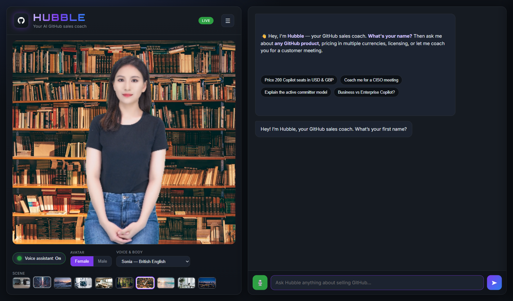

# Hubble — Your GitHub Sales Coach 🛰️

An AI voice + avatar coach that helps sellers get up to speed selling the **entire GitHub portfolio**. Hubble is deep product/commercial expert, researcher and sales coach in one — built on **Azure AI Foundry (GPT‑5.4)** with the **Agent framework**, a **real‑time talking avatar**, **speech‑to‑text**, and a clean single‑page web app.



## What it does
- **GitHub-branded identity** — Octocat logo as the app icon and infused into the idle orb; "HUBBLE" wordmark in a technical display font with the strapline *Your AI GitHub sales coach*.
- **Strictly GitHub-only** — Hubble answers only on GitHub products, pricing, licensing and selling. Anything off-topic gets a friendly redirect with example questions to ask instead.
- **Greets you by name** — when a conversation starts, Hubble asks your first name and uses it throughout.
- **Conversational, spoken style** — short, get-to-the-point answers (no monologues); when an answer would be long, Hubble gives the headline and **asks if you want the long version**.
- **Coaches around the answer** — explains the surrounding GitHub context and customer impact, and proactively asks for customer/deal context to tailor pricing, discovery questions, positioning and next steps.
- **Official documentation links in chat** — answers include clickable official GitHub / Microsoft Learn links (never read aloud).
- **Hideaway resources drawer** — a slide-in panel (☰) with curated links to GitHub pricing, Copilot, Advanced Security, docs, Trust Center, roadmap, changelog and more.
- **Voice assistant on/off** — toggle a live, lip‑synced **talking avatar** that speaks Hubble's replies.
- **Barge-in** — typing or talking instantly stops the avatar mid-sentence and refocuses on the new question (thread keeps context).
- **Stop button** — a red ⏹ Stop appears while Hubble is speaking to silence the avatar on demand.
- **Hands the mic back** — after Hubble finishes speaking, the mic re-opens automatically — **except** when you signal you're ending the call (e.g. "bye", "that's all"), where it stays closed.
- **Avatar bodies tied to each voice** — every voice picks a **distinct avatar body** (Lisa, Lori, Meg female; Harry, Max male). Changing the voice changes who you see.
- **Scene backgrounds** — 10 photographic landscape/office scenes chroma-keyed behind the avatar. The **scene picker only appears while the avatar is live**, and **randomises on first load**.
- **Type or talk** — full text chat plus a **microphone** (speech‑to‑text) input.

## Architecture
```
Browser SPA (public/)
  ├── Chat UI ──────────────► POST /api/chat ──► Azure AI Foundry Agent (gpt‑5.4)
  │                                              └─ file_search over GitHub KB (vector store) → citations
  ├── Talking avatar (WebRTC) ─ GET /api/relay-token ─► Azure Speech avatar relay (ICE)
  └── STT + avatar TTS ──────── GET /api/speech-token ─► Speech token (keyless)

Backend (server.mjs, Express, Node)
  └── DefaultAzureCredential (Entra ID) — keyless throughout
      └─ exchanges an Entra token for a Speech token via the AIServices custom‑domain STS
```

### Azure resources (Sweden Central)
| Resource | Purpose |
|----------|---------|
| `hubble-foundry` (AIServices) + project `hubble-proj` | Foundry project hosting the agent |
| `gpt-5.4` deployment | The agent model |
| `hubble-foundry` custom‑domain STS | Mints keyless Speech tokens (Entra → Speech token) |
| Azure Speech (Sweden Central) | Real‑time TTS avatar + speech‑to‑text |

> **Auth is 100% keyless (Microsoft Entra ID).** No API keys are stored or sent to the browser. The tenant enforces `disableLocalAuth`, so the backend uses `DefaultAzureCredential` and brokers short‑lived Speech tokens to the client.

## Project layout
```
.
├── knowledge/                 GitHub product/pricing/licensing/coaching KB (→ vector store)
├── public/                    Single‑page app (index.html, styles.css, app.js)
├── setup-agent.mjs            Uploads KB, builds vector store, creates the Hubble agent
├── server.mjs                 Express backend (chat proxy + token brokers + static)
├── agent-meta.json            Generated: agent id, vector store id, file→source map
└── .env                       Config (no secrets — endpoints + ids only)
```

## Prerequisites
- Node.js 20+ and Azure CLI, signed in: `az login` (account with **Cognitive Services User** on the Foundry + Speech resources).
- The Azure resources above (already provisioned in the sandbox subscription).

## Run it
```powershell
npm install
npm run setup     # one‑time: creates the agent + vector store, writes AGENT_ID to .env
npm run update    # re‑apply Hubble's instructions/persona to the existing agent (after edits)
npm start         # serves http://localhost:3000
```
Then open **http://localhost:3000**, ask a question, and click **Voice assistant: Off → On** to bring the avatar to life. Use the **Female/Male** toggle and **Voice** dropdown to change the presenter. Click the **🎙️** to talk.

## API
| Endpoint | Method | Purpose |
|----------|--------|---------|
| `/api/config` | GET | Agent name, voice + avatar catalogue |
| `/api/chat` | POST | `{ message, threadId? }` → `{ threadId, reply, citations[] }` |
| `/api/speech-token` | GET | Keyless Speech auth token + region (for browser SDK) |
| `/api/relay-token` | GET | ICE/relay servers for the avatar WebRTC peer connection |

## Notes
- Pricing in the knowledge base was **verified June 2026**; Hubble always reminds sellers to confirm live pricing at github.com/pricing before quoting formally. GBP/EUR figures are indicative conversions, not GitHub's billed local price.
- To re‑provision the agent after editing the KB, just re‑run `npm run setup`.
