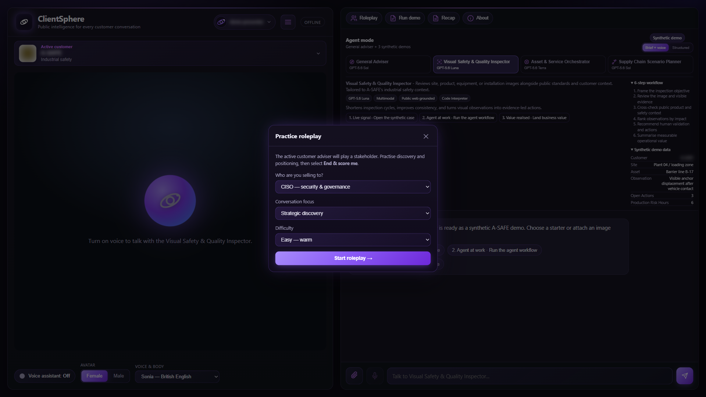
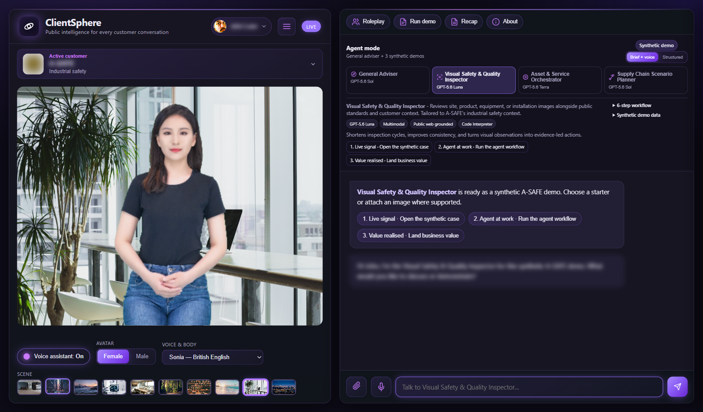
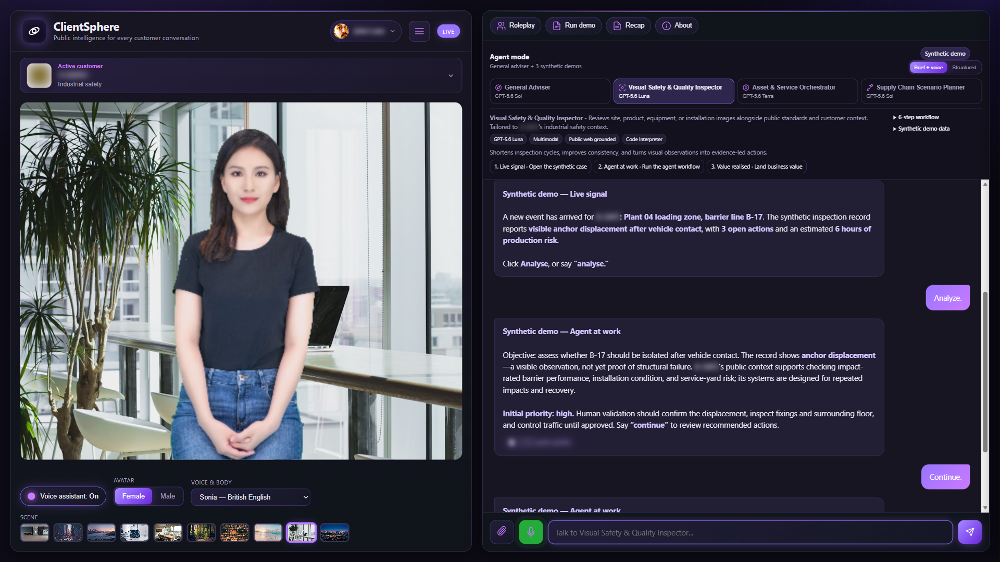

# ClientSphere product tour

> **Documentation:** [Home](../README.md) · [AI-assisted setup](../AI-SETUP-PROMPT.md) · [Manual setup](../SELF-HOSTING.md) · [Product definition](../PRODUCT.md)

These screenshots show the major user and administrator journeys. Every image is redacted or uses synthetic demonstration data; no screenshot should be used as evidence about a real customer.

## 1. Choose the customer and working mode

The persistent customer context keeps the active organisation visible while the user chooses the general adviser or one of three sector-tailored use cases.

## 2. Review public intelligence

The intelligence view organises official public sources into a meeting-ready brief without importing private account or CRM data.

## 3. Run a structured agent workflow

Structured mode exposes the operating steps, synthetic inputs, controls, and expected business value so the presenter can show how an agent works rather than only chat about it.

## 4. Rehearse a customer conversation

Roleplay mode helps a user practise discovery, objections, and concise responses in the context of the selected customer.

## 5. Use voice and a real-time avatar

Azure Speech provides the voice/avatar experience. Standard voices are available without custom likeness training.

The avatar can guide a synthetic customer-labelled workflow while the structured evidence remains visible.

## 6. Inspect the deployed Foundry agent

Each customer mode is represented by a managed Foundry agent connected to the customer's isolated vector store and approved tools.

## 7. Govern access

The synthetic admin example shows pending/approved users, administrator promotion, sole-admin protection, and usage/log views.

## Use these images in a fork

You may retain these redacted/synthetic examples. If you replace them:

- capture only data you are authorised to publish;
- remove usernames, email addresses, tenant/subscription IDs, customer-confidential data, tokens, and URLs containing secrets;
- label synthetic inputs and outcomes visibly;
- keep the same relative filenames or update every Markdown reference;
- inspect the final image at full resolution before committing it.
